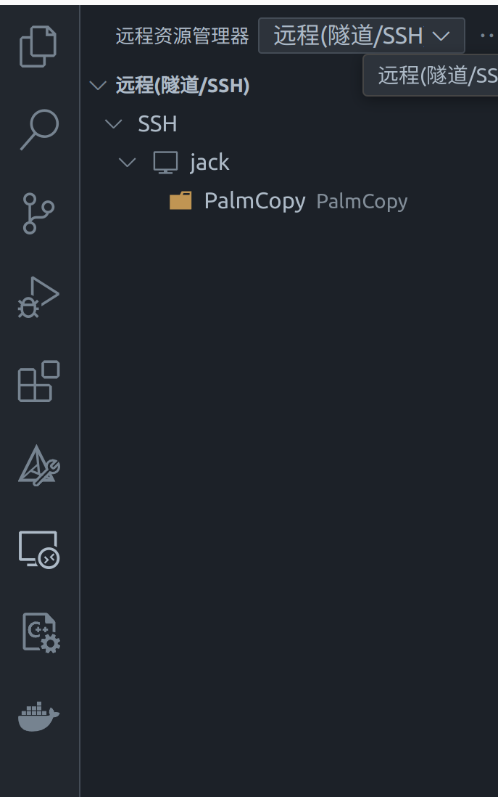
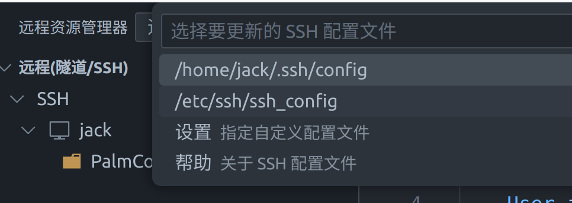
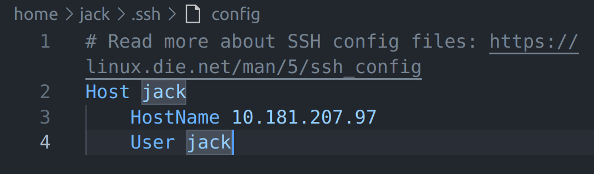

# linux

linux相关工具：

```
vim //编辑文档
fim //查看图片
grdit //图像化界面编辑文档
boot-repair //修复引导区
```

动态库静态库：

```
linux下：
.a 静态库  "archive" 文件
.so 动态库 "shared object" 
win下：
.lib 静态库 “Library file”
.dll 动态库 “Dynamic Link Library”
```

环境变量相关：

```
/etc/profile：此文件为系统的每个用户设置环境信息，当用户第一次登录时，该文件被执行，并从/etc/profile.d目录的配置文件中搜集shell的设置。
/etc/bashrc：为每一个运行bash shell的用户执行此文件，当bash shell被打开时，该文件被读取。
~/.bash_profile：每个用户都可使用该文件输入专用于自己使用的shell信息，当用户登录时，该文件仅仅执行一次!默认情况下，他设置一些环境变量，执行用户的.bashrc文件。是交互式login 方式进入 bash 运行的。
~/.bashrc：该文件包含专用于你的bash shell的bash信息，当登录时以及每次打开新的shell时，该文件被读取。交互式 non-login 方式进入 bash 运行的。

https://www.cnblogs.com/renyz/p/11351934.html
（Linux进阶之环境变量文件/etc/profile、/etc/bashrc、/etc/environment）
```

深度学习部署相关：

```bash
nvidia-smi  # 显示显卡信息
watch -n 1 nvidia-smi  # 定时刷新这个信息
```

```
YoLo的Darknet框架：
.cfg 和 .weights 文件，一个是描述模型结构的配置文件（通常是 .cfg 文件），另一个是包含权重的二进制文件（通常是 .weights 文件）。

PyTorch 框架：
.pt 文件：PyTorch 模型文件，包含了 PyTorch 框架中的模型结构和权重。

TensorFlow 框架：
.pb 文件：TensorFlow 的 Protocol Buffer 文件，包含了 TensorFlow 框架中的模型结构和权重。

MXNet 模型文件结构：
.json 文件：存储模型的结构，包括网络的定义。
.params 文件：存储模型的权重和参数。

Caffe 模型文件结构：
.prototxt 文件：存储模型的结构，包括网络的定义。
.caffemodel 文件：存储模型的权重和参数。

跨框架的模型交换格式，支持多个深度学习框架，如 PyTorch、TensorFlow、Caffe2 等。
可以通过相应的导出函数进行模型转换：

.onnx 文件：Open Neural Network Exchange 格式，用于跨框架的模型交换，可以从 PyTorch 或 TensorFlow 导出，然后通过 TensorRT 进行优化。

TensorRT ：
.plan 文件：通常由 ONNX 模型转换而来，通过 TensorRT 的 API 进行优化和生成。
```

# Docker

## 1、基础用法

```bash
docker pull ubuntu:latest
docker ps
docker ps -a
docker images
docker stop
docker start
docker restart
docker rm <container_name>
docker rmi <image_name>
docker rmi -f <image_name> #强制删除

//改容器名称
docker rename <elder-contaner-name> <new-contaner-name>
// 改镜像名称
docker tag <elder-image-name> <new-image-name>
```

## 2、镜像 -> 容器

```bash
docker run -it \
	--name pytorch \
    --gpus all \
    --ipc=host  (或者--shm-size=2GB) \
    --network host \
    --device=/dev/video0 \
    --device=/dev/video1 \
    --device=/dev/video2 \
    --device=/dev/video3 \
    -e DISPLAY=$DISPLAY \
    -e XAUTHORITY=$XAUTHORITY \
    -v /tmp/.X11-unix:/tmp/.X11-unix \
    -v $XAUTHORITY:$XAUTHORITY \
    -v /home/jack/workspace:/home/workspace \
    -v /home/jack/repository:/home/repository \     
     palm:1.4
     
  ( -v /home/user/conan2:/root/.conan2  //挂载conan到本地 )
```

--gpus all  //宿主机下载好NVIDIA Container Toolkit后，容器使用宿主机GPU
--ipc=host  (或者--shm-size=2GB) 运行容器的默认共享内存host是与宿主机共享，后者是指定大小
--device=/dev/video0  //挂载宿主机外设      --network host // 使用宿主机网络

`-e` 选项用于设置环境变量：

	-e DISPLAY=$DISPLAY \
	-e XAUTHORITY=$XAUTHORITY \
	-v /tmp/.X11-unix:/tmp/.X11-unix \  
	-v $XAUTHORITY:$XAUTHORITY \    //图像显示和摄像头显示端口映射到宿主机
以上四个参数的组合使得 Docker 容器可以访问主机的图形用户界面，容器中运行图形应用程序的窗口保证可以显示在主机的桌面上。

-v /home/jack/workspace:/home/workspace   //挂载宿主机文件夹
      

## 3、容器 -> 镜像

```bash
docker commit <要commit的容器名> <要命名的镜像名:版本号>
```

## 4、容器、镜像的运行与保存

###        容器的启动与运行

```bash
//在一个运行的容器中打开一个新的终端会话
docker run -it --name <container_name> <image_name>  //先生成容器
docker exec -it <container_name> /bin/bash    // 终端打开运行的容器（若并未运行则先start运行）

//启动一个 Docker 容器，在退出容器后自动删除它
docker run --rm -it <镜像名> /bin/bash
```

###          保存和导入容器/镜像

```bash
//将一个容器的文件系统导出为一个 tar 文件
docker export -o my_container.tar my_container

//从一个 tar 文件中导入容器文件系统
docker import my_container.tar

// 将一个镜像保存为一个 tar 文件
docker save -o my_image.tar ubuntu:latest

// 从一个 tar 文件中加载镜像
docker load -i my_image.tar
```

## 5、Docker登录

https://hub.docker.com/

### 1. 登录 / 退出 Docker Hub

```shell
docker login  # 登录 Docker Hub
docker logout  # 退出 docker hub 
```

### 2. 正确命名镜像（包括用户名）

当推送镜像到 Docker Hub 时，镜像的名称必须包含你的 Docker Hub 用户名。例如，如果你的用户名是 `myusername`，并且你要推送的镜像叫做 `myapp`，你需要重新标记镜像，使其名称包含用户名：

```bash
docker tag app:v1 myusername/app:v1
```

### 3. 推送 / 拉取镜像

```bash
docker push myusername/myapp:v1   # 确保镜像名称和版本正确后，执行推送命令
docker search ubuntu
docker pull ubuntu  # 拉取镜像,将官方 ubuntu 镜像下载到本地
```


## 6、Dockerfile

**Dockerfile 举例：**

```dockerfile
# 使用 Ubuntu 2004作为基础镜像
FROM ubuntu:20.04

# 设置非交互模式
ENV DEBIAN_FRONTEND=noninteractive

# 设置工作目录
WORKDIR /home/workspace

COPY ./sources.list /etc/apt/sources.list

# 更新包列表并安装基础工具
RUN set -eux \
    && apt-get update \
    && apt-get -yq upgrade \
    && apt-get -yq install \
    build-essential \
    wget curl \
    git \
    vim fim\
    sudo \
    lsb-release \
    openssh-server \
    software-properties-common \
    gnupg2 \
    python3-pip \
    libssl-dev \
    ca-certificates \
    ninja-build \
    openssh-server \
    sudo \
    pkg-config \
    valgrind \
    tini \

    clang \
    clangd \
    lldb \
    cmake \
    && rm -rf /var/lib/apt/lists/*

# 安装 Conan 2.x 包管理器
RUN pip3 install conan==2.0.5

# 设置 C++ 编译环境，使用 clang 作为默认编译器
RUN update-alternatives --install /usr/bin/cc cc /usr/bin/clang 100 \
    && update-alternatives --install /usr/bin/c++ c++ /usr/bin/clang++ 100

# 清理临时文件
RUN apt-get clean && rm -rf /var/lib/apt/lists/*


# 配置环境变量
ENV CC=clang
ENV CXX=clang++

# 将容器内的 clangd 与 lldb 设置为 VS Code Remote C++ 插件的调试工具
RUN ln -s /usr/bin/clangd /usr/local/bin/clangd \
    && ln -s /usr/bin/lldb /usr/local/bin/lldb

# 安装完成后展示版本信息
RUN clang --version && lldb --version && cmake --version && conan --version

# 设置 Conan 默认配置
RUN conan profile detect --force

# 清理临时文件
RUN apt-get clean && rm -rf /var/lib/apt/lists/*

# 设置 Tini 作为 init 进程
ENTRYPOINT ["/usr/bin/tini", "--"]

# 设置默认命令
CMD ["/bin/bash", "-l"]

# 指定镜像名称
LABEL version="4.9" description="C++ clangd lldb Cmake Conan2 + OpenCV development environment"

```

**source.list 举例：**

```bash
# 默认注释了源码镜像以提高 apt update 速度，如有需要可自行取消注释
deb http://mirrors.tuna.tsinghua.edu.cn/ubuntu/ jammy main restricted universe multiverse
# deb-src http://mirrors.tuna.tsinghua.edu.cn/ubuntu/ jammy main restricted universe multiverse
deb http://mirrors.tuna.tsinghua.edu.cn/ubuntu/ jammy-updates main restricted universe multiverse
# deb-src http://mirrors.tuna.tsinghua.edu.cn/ubuntu/ jammy-updates main restricted universe multiverse
deb http://mirrors.tuna.tsinghua.edu.cn/ubuntu/ jammy-backports main restricted universe multiverse
# deb-src http://mirrors.tuna.tsinghua.edu.cn/ubuntu/ jammy-backports main restricted universe multiverse

# 以下安全更新软件源包含了官方源与镜像站配置，如有需要可自行修改注释切换
deb http://security.ubuntu.com/ubuntu/ jammy-security main restricted universe multiverse
# deb-src http://security.ubuntu.com/ubuntu/ jammy-security main restricted universe multiverse

# 预发布软件源，不建议启用
# deb http://mirrors.tuna.tsinghua.edu.cn/ubuntu/ jammy-proposed main restricted universe multiverse
# # deb-src http://mirrors.tuna.tsinghua.edu.cn/ubuntu/ jammy-proposed main restricted universe multiverse
```

**基本构建命令：**

```bash
docker build -t <镜像名称>:<标签> <Dockerfile 所在的目录>
EG:
docker build -t my-image:latest .
docker build --network host -t my-image:latest .  #使用宿主进的网络，否则很可能下载不通
```

在构建时，可以使用 `--build-arg` 来传递参数：

```bash
docker build --build-arg APP_ENV=development -t my-dev-image .
```

这样构建出的镜像中会使用 `APP_ENV=development`。


## 7、创建容器修改地

docker run -it \
    --name faa7264cc3b5 \
    --gpus all \
    --ipc=host \
    --device=/dev/video0 \
    --device=/dev/video1 \
    --device=/dev/video2 \
    --device=/dev/video3 \
    -e DISPLAY=$DISPLAY \
    -e XAUTHORITY=$XAUTHORITY \
    -v /tmp/.X11-unix:/tmp/.X11-unix \
    -v $XAUTHORITY:$XAUTHORITY \
    -v /home/jack/workspace:/home/workspace \
    -v /home/jack/repository:/home/repository \
	faa7264cc3b5
     


# Git

## 一、本地git

提交push：工作目录 ——> 暂存区 ——> 本地仓库 ——> 远程仓库：文件必须一步一步的提交
拉取pull：远程仓库 ——> 本地仓库 ——> 暂存区 ——> 工作目录：文件可以依次“检出”，也可以直接从远程仓库“检出”到工作目录


### 1. 初始化和克隆仓库

```bash
git init  # 创建新的 Git 仓库
git clone <repository-url>  # 克隆远程仓库
```

### 2. 查看状态和历史

```bash
git status  	   # 查看当前状态
git diff		   # 查看当前工作目录和暂存区之间的差异
git diff -cached   # 查看暂存区和最近一次提交之间的差异
git log			   # 查看提交历史
git log --oneline  # 查看简洁历史（单行显示）
git log --graph -- pretty=oneline # 查看带有冲突解决的日志
```

### 3. Git三板斧——添加、提交、拉取和推送 

```bash
git add <file-name>  # 添加文件到暂存区
git add .    		 # 添加所有更改
```

```bash
git commit -m "日志内容"  # 提交更改
```

```bash
git pull  # 从远程仓库拉取最新更改，相当于  git fetch origin + git merge origin/next
git push origin <branch-name>  # 将本地更改推送到远程仓库
```

## 二、分支

#### 分支细分

1. 主分支（master）：第一次向 git 仓库提交更新记录时自动产生的一个分支。
2. 开发分支（develop）：作为开发的分支，基于 master 分支创建。
3. 功能分支（feature）：作为开发具体功能的分支基于开发分支创建。

### 4.分支操作

```bash
git branch  ( -r )     # 查看分支
git branch <name>      # 创建分支
git breach -d <name>   # 删除分支（分支合并后才允许被删除）（-D 大写强制删除）

git checkout <name>    # 切换分支
git checkout -b <name> # 创建+切换分支

git merge <name>       # 合并某分支到当前分支
```

### 5. 合并和变基

```bash
git merge <branch-name>  // 合并分支
git rebase <branch-name> // 变基分支
```

```bash
git add <file-with-conflict>   # 解决冲突：在合并或变基时，可能会出现冲突。Git 会提示你去解决这些冲突，编辑冲突的文件，解决后，使用此命令标记为已解决
git commit  # 完成合并
```

### 6. 查看和管理远程仓库

```bash
git remote -v  # 查看远程仓库信息
git remote add <name> <repository-url>  # 添加远程仓库
git remote remove <name>  # 删除远程仓库
```

### 7. 标签管理

```bash
git tag <tag-name>  // 创建标签
git tag //查看标签
git push origin <tag-name>  //推送标签到远程
```

### 8. 其他常用命令

```bash
git reset <file-name>   # 撤销暂存区文件
git checkout -- <file-name>  # 撤销未提交的更改
git rm <name> # 删除仓库中的文件
git .git rm   # 删除本地仓库 
git help <command>  # 查看帮助
```

## 三、远程github

### 1、fetch与push

​	**fetch**： `fetch` 命令用于从远程仓库下载最新的提交和数据到本地，但并不会自动合并这些更改。执行 `git fetch` 后，你可以查看和审查远程仓库的更新，而不会影响你当前的工作版本。这是一个安全的操作，可以有效地让开发者保持与远程仓库的同步，在深入了解远程更新后决定如何处理这些更改，比如是否合并到当前工作分支。

​	**push**： `push` 命令则用于将本地的提交推送到远程仓库。这意味着你可以将自己完成的工作共享到远程 repository，以便其它团队成员可以访问和使用这些更改。当你执行 `git push` 时，本地分支的提交会被上传到远程仓库中相应的分支，这样可以将你的工作整合到团队的协作中。

**基本用法**

1. **获取远程仓库的更新**： 要从名为 `origin` 的远程仓库获取更新，这将下载 `origin` 的所有分支和标签的最新提交，但你的本地分支不会受到影响。

   ```bash
   git fetch origin
   ```

2. **查看所有分支的更新，或使用 `git log` 查看特定远程分支的提交历史**： 

   ```bash
   git branch -r
   git log origin/master --oneline --graph
   ```

3. **合并或变基更新**：

   ```bash
   git merge origin/master   # 获取的更新合并到你的当前分支
   git rebase origin/master  # 变基，改变放到这个版本后面，线性
   ```

### 2、远端与本地有冲突的默认选择模式：

```bash
git config pull.rebase false #合并: Git会通过创建一个新的合并提交来将远程的更改合并到你的本地分支。
git config pull.rebase true  #变基： Git会将你的本地提交“移动”到远程提交之上，这样可以保持更线性的提交历史。
git config pull.ff only      #仅快进：仅在可以快进合并时进行合并，如果不可以快进，会拒绝操作。这通常用于保持提交历史的简洁。
```

### 3、refs是什么

1. **`refs/heads/`**：指向本地分支。例如，`refs/heads/master` 代表名为 `master` 的本地分支。
2. **`refs/remotes/`**：指向远程分支。例如，`refs/remotes/origin/master` 代表 `origin` 远程仓库中的 `master` 分支。
3. **`refs/tags/`**：指向标签，例如，`refs/tags/v1.0` 代表一个标签。

```bash
origin/master` 是指名为 `origin` 的远程仓库中的 `master` 分支。Git 默认将你克隆的远程仓库命名为 `origin
```

### 4、SSH连接

##### 第一步：检查本地主机是否已经存在ssh key， 如果存在，直接跳到第三步

```bash
cd ~/.ssh
ls     #看是否存在 id_rsa(密钥)和 id_rsa.pub(公钥)文件，如果存在，说明已经有SSH Key
```

##### 第二步：生成ssh key

```bash
ssh-keygen -t rsa -C "xxx@xxx.com"    #执行后一直回车即可
```

##### 第三步：获取ssh key公钥内容（id_rsa.pub）

```bash
cd ~/.ssh
vim id_rsa.pub # 复制公钥
```

##### 第四步：Github账号上添加公钥

-  进入Settings设置
- SSH and GPG keys 中，添加ssh key，把刚才复制的内容粘贴上去保存即可

##### 第五步：验证是否设置成功

```bash
ssh -T git@github.com
```

# SSH

### 1. 安装 OpenSSH Server

如果你在目标机器上没有安装 SSH 服务，可以通过以下命令安装 OpenSSH Server：

```
sudo apt update
sudo apt install openssh-server
```

### 2. 启动 SSH 服务

安装完成后，确保 SSH 服务正在运行：

```
sudo systemctl start ssh
sudo systemctl enable ssh  # 使其在启动时自动运行
```

### 3. 检查 SSH 服务状态

确认 SSH 服务是否已启动并正在运行：

```
sudo systemctl status ssh
```

你应该看到服务的状态是 "active (running)"。

### 4. 防火墙设置

确保防火墙允许 SSH 连接。你可以使用以下命令来检查和修改防火墙设置：

```bash
sudo ufw allow ssh  # 允许SSH连接
sudo ufw enable     # 启用防火墙（如果尚未启用）disable（这里工位电脑开启的话下使用conan下载不了github文件，所以就关闭了）
```

### 5. 确认 SSH 端口和配置

默认情况下，SSH 使用端口 22。你可以确认端口配置，确保没有其他服务占用这个端口。

SSH 配置文件通常位于 `/etc/ssh/sshd_config`。你可以检查这个文件，确保没有配置错误。

### 6. 重启 SSH 服务

如果你对 SSH 配置文件做了更改，记得重启 SSH 服务使其生效：

```bash
sudo systemctl restart ssh
```

### 7. 再次尝试连接

完成上述步骤后，再次尝试从你的计算机使用 SSH 连接到目标机器：

```
ssh user@XJTU_MIP  # 使用目标主机的用户名
```

### 8. VSCode上SSH连接

1、下载拓展Remote - SSH

2、点击远程资源管理器选项卡，选择远程（隧道/SSH）类别。



3、点击SSH右边的齿轮案件，在中间上部分弹出的配置文件中点击第一个....config。



4、在点进的config文件中输入以下内容。



- Host是服务器主机的用户名


- hostname是服务器的ip地址；（ifcofig）


- port端口号有就写上，没有的话可以不写；


- user是服务器上用户的用户名


（例如：Linux中 “用户名”+@+“服务器ip地址” 就是访问服务器上用户的服务器用户访问地址。）

  点击保存后点击刷新按钮，这时候就可以看到刚刚创建的配置了。

5、Ctrl + Shift + P，打开命令窗口，输入ssh connect to host，选择第一个，选择刚刚创建好的那个配置。或者直接左侧栏点击配置好的jack，点击新窗口打开。询问是否保存known_hosts，选择Continue，输入服务器上用户的密码。

6、该用户第一次访问该服务器可以看到该提示信息，耐心等待，这时是插件在服务器上面安装需要的依赖，大约会占用服务器150mb左右的空间。如果长时间都一直是该情况，可以使用Ctrl + Shift + P，打开命令窗口，输入reload window来重新加载窗口（会要求你重新手动输入密码）。

### 总结

如果在安装或启动过程中遇到其他错误，请查看系统日志，可能会提供更具体的信息：

```
journalctl -xe  # 查看系统日志以获取详细信息
```
